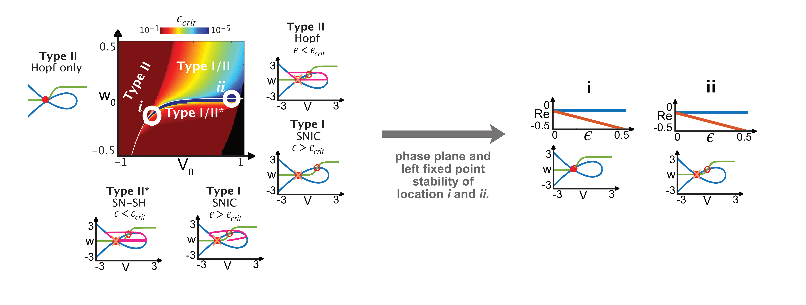

# Generalised Neuronal Excitability

This repo contains research code for the further generalisation of neuronal excitability in classical phenomenological models and models that incorporates a slow regenerative current. This was developed as part of the following manuscript, which focuses on the further generalisation of neuronal excitability by incorporating a slow regenerative current:

> [Generalisation of neuronal excitability due to the incorporation of a slow regenerative current.](https://doi.org/10.1016/j.neuron.2019.10.020).<br>
Broek JAC, Drion G (2020). *ArXiv*. 105(2):246-259.e8

The code contains results of the following models: Fitzhugh-Nagumo (FHN), mirrored Fitzhugh-Nagumo (mFHN), reduced Connor-Stevens (CSred), and reduced Hodgkin-Huxley with Ca$^+$ (HHCared).

## Abstract

Neuronal excitability is the phenomena that describes action potential generation due to a stimulus input. Commonly, neuronal excitability is divided into two classes: Type I and Type II, both having different properties that affect information processing, such as thresholding and gain scaling. These properties can be mathematically studied using generalised phenomenological models, such as the Fitzhugh-Nagumo (FHN) model and the mirrored FHN (mFHN). The FHN model shows that each excitability type corresponds to one specific type of bifurcation in the phase plane: Type I underlies a saddle-node on invariant cycle (SNIC) bifurcation, and Type II a Hopf bifurcation. However, the difficulty of modelling Type I excitability is that it is not only represented by its underlying bifurcation, but also should be able to generate infinite period frequency while maintaining a small depolarising current. Using the mFHN model, we show that this situation is possible without modifying the phase portrait, due to the incorporation of a slow regenerative variable. We show that in the singular limit of the mFHN model, the time-scale separation can be chosen such that there is a configuration of a classical phase portrait that allows for SNIC bifurcation, infinite period frequency and a depolarising current, such as observed in Type I excitability. Using the definition of slow conductance, $g_s$, we show that these mathematical findings for excitability change are translatable to reduced conductance based models and also relates to an experimentally measurable quantity. This not only allows for a measure of excitability change, but also relates the mathematical parameters that indicate a physiological Type I excitability to parameters that can be tuned during experiments. Therefore, not only did we indicate a region in a generalised phenomenological model that translates to the physiological conditions of Type I and Type II excitability, but also found mathematical parameter that are measurable in an experimental setting.



## Getting started

Either download or clone the repo:

```
git clone https://github.com/Jan10e/Broek_Neuron-Excitability_2020/
```

Then navigate to the downloaded folder:

```
cd /path/to/Broek_Neuron-Excitability_2020
```

You will need to repeat these steps if we update the code.


## Citation

If you found this resource useful, please consider citing [this paper](https://doi.org/10.1016/j.neuron.2018.05.015).

```
@ARTICLE{Broek2020,
  title    = "Generalisation of neuronal excitability due to the incorporation of a slow regenerative current.",
  author   = "Broek, Jantine AC and Drion, Guillaume",
  journal  = "ArXiv",
  volume   =  98,
  number   =  6,
  pages    = "1099--1115.e8",
  month    =  jun,
  year     =  2020,
}
```

## Contact

jantine.broek.science@gmail.com (or open an issue here).
